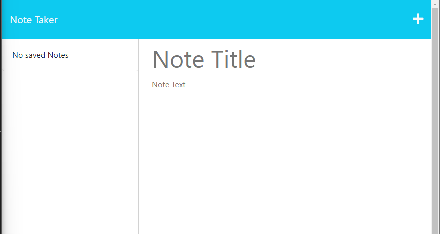
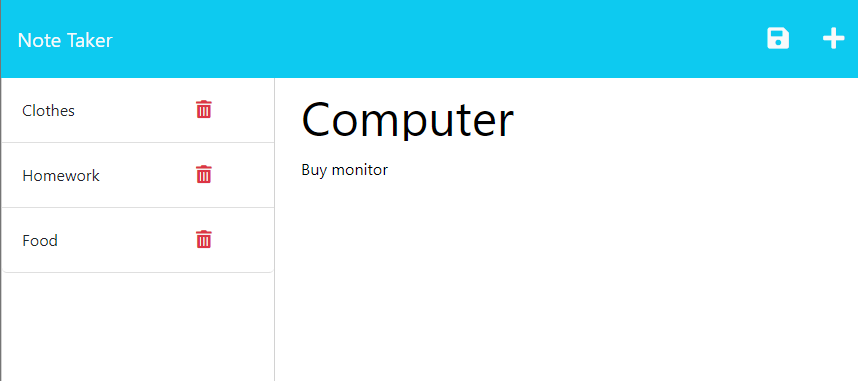

# Express.js Note Taker <!-- omit in toc -->

## Table of contents <!-- omit in toc -->

- [Description](#description)
- [Usage](#usage)
- [Mock Up](#mock-up)
- [Credits](#credits)
- [License](#license)
- [Links](#links)

## Description
This app allows the user to create, store and manage personal notes. This app has been built with Express.js, allowing an easy and intuitive user experience.

For user convenience, the app is deployed in Heroku, so you don't have to clone this repository. [Click here](https://www.heroku.com/home) for more information about Heroku

## Usage
### Landing page <!-- omit in toc -->
- The landing page consist of 3 elements:
  - Header: At the top of the page, you will see the title of the application to left. To the right of the header element, you will fin a button to create a new note, as well as a button to save a newly created note.
  - Note list: To the left of the application, you can see a list of all previously created notes. (**NOTE:** If there are no notes created, a message will appear with the legend "No saved Notes")
  - Note template: The right side of the application contains a template for a new note, containing a Title and a Content section. Here, the user can write down their notes and once finished, click on the *save* icon to save their notes.

## Mock Up

### Landing page <!-- omit in toc -->

### Example of webpage with notes created <!-- omit in toc -->

--- <!-- omit in toc -->

## Credits
- Code by: [Daniel Sanchez](https://github.com/Morkendi)
- Started cody by: [Tec Bootcamp](https://github.com/coding-boot-camp/miniature-eureka)

## License

This project utilizes an [MIT License](https://choosealicense.com/licenses/mit/)

## Links
- Link to [GitHub repo](https://github.com/Morkendi/Note-Taker)
- Link to [Heroku Deployment](https://intense-atoll-61658.herokuapp.com/notes)